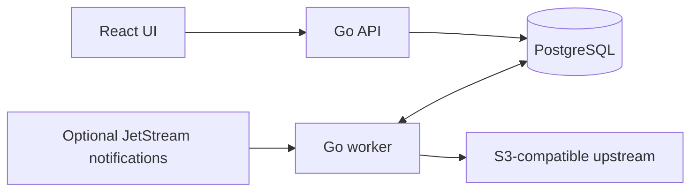

# Architecture and engineering notes

Pithosys catalogs objects in existing S3-compatible storage without copying their contents. PostgreSQL stores metadata, provenance, saved queries, relations, and durable job state. The React UI talks to a Go API; a separate Go worker reconciles upstream listings and metadata.

## Durable synchronization

A sync job paginates the upstream listing into PostgreSQL spill storage and fans out import, refresh, and removal work. Job traces retain parent-child relationships, progress, and errors. Persisted listing checkpoints let retries continue after a failed page. Spill keys must survive until terminal success: deleting them before recording completion creates a crash window where a resumed job mistakes previously listed objects for upstream deletions. Terminal success now removes the spill in the same database statement.

Prefix matching is literal, including `%` and `_` in object keys. Recovery enumerates all child-job pages; a fixed-size first page silently loses part of a large fanout. Small and empty catalogs scan all partitions so newly appearing objects can be found.

## Search and metadata

PithosysQL parses a small query language, binds attribute paths and types against the catalog, and compiles parameterized PostgreSQL queries. JSONB supports sparse upstream metadata and user annotations without per-field schema migrations. Attribute provenance distinguishes sources. The API limits query bytes, expression nesting, runtime, and returned objects; it is not an unrestricted SQL endpoint.

Read the numbered [design decisions](../decisions) for tradeoffs. JSONB flexibility has indexing and query-planning costs, and a single PostgreSQL service simplifies deployment at the cost of concentrating scheduling and storage load.

## Scope and limitations

This is an alpha project, not a claim of production scale. The demo exercises local S3 listing/HEAD, indexing, search, annotations, and collections. Optional JetStream ingestion and OIDC exist, but require environment-specific integration testing. There is no multi-tenant isolation guarantee. Administrators are trusted operators. Large catalogs, extended upstream outages, multi-worker lease recovery, and backup/restore drills need further validation.

The earlier Python gateway is retained in Git history at `archive/python-reference`; active source contains only the Go/React implementation.
